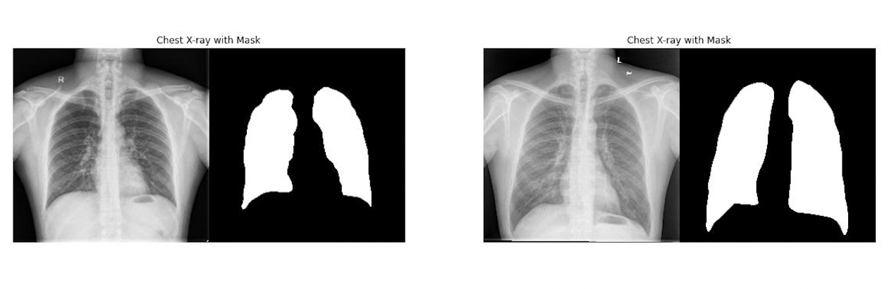
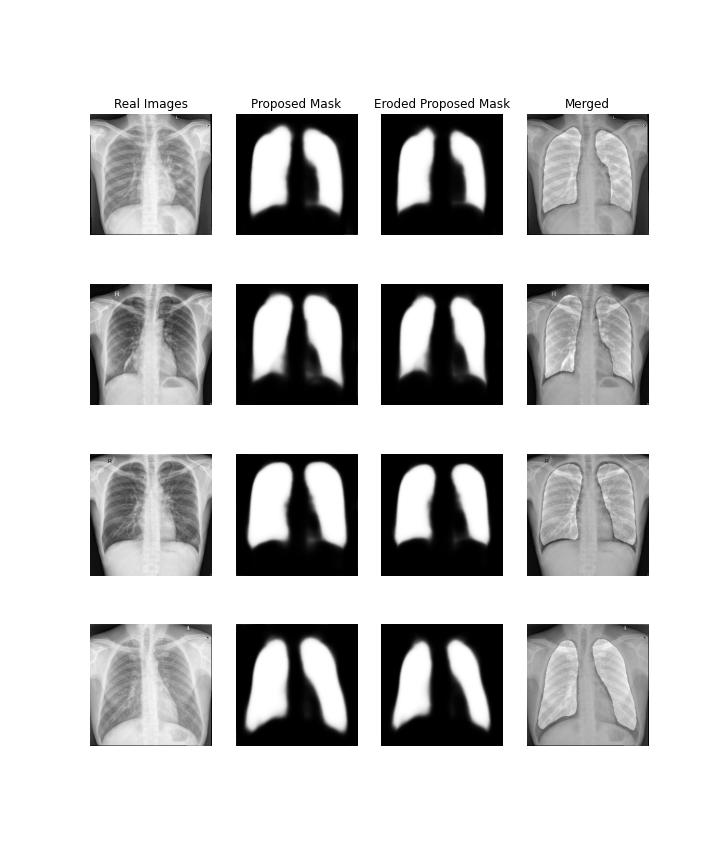
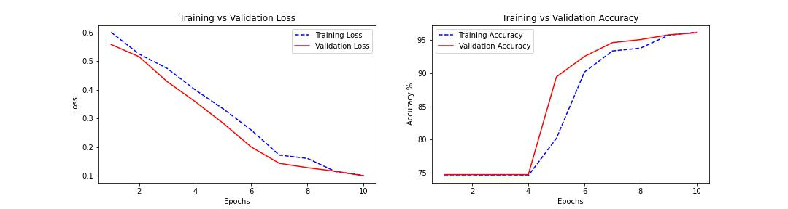

# Lung-Segmentation
My first experience with U-net
Notebook can be also found on [kaggle](https://www.kaggle.com/code/rostekus/lung-segmentation/notebook)

Data set on kaggle: [Chest Xray Masks and Labels](https://www.google.com)

### Dataset
Dataset contains x-rays and corresponding masks.

   
 

 
 ### Model
U-net was used for model architecture

   
 

 Accuracy of model is about 95%
 

   
 

